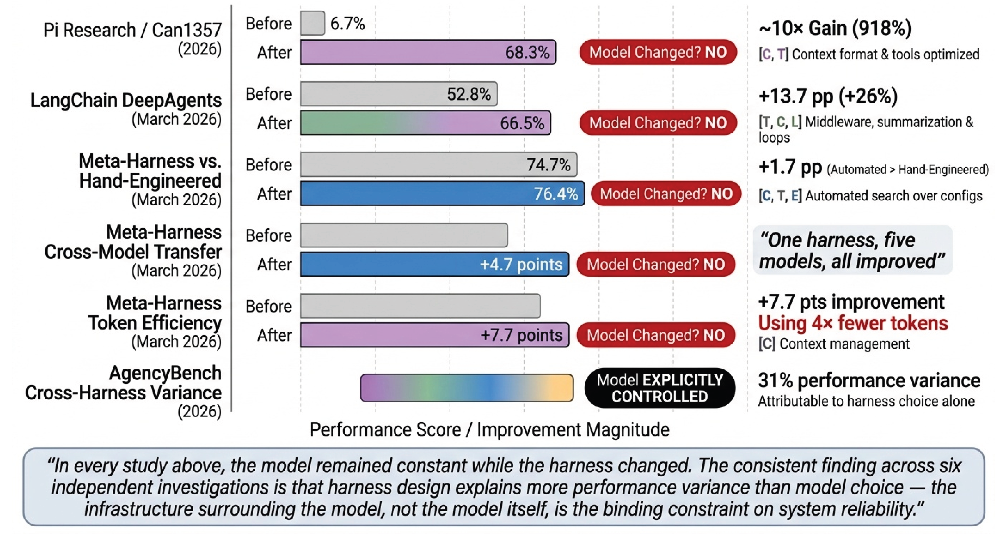
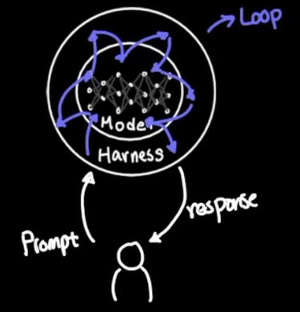
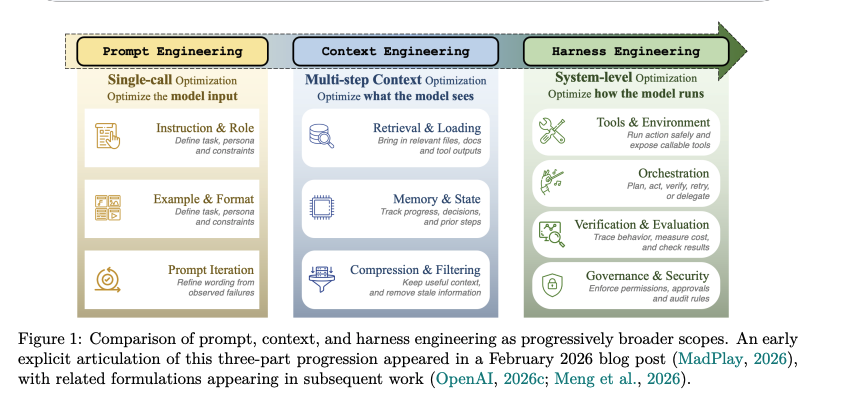

## In short

I hear the word "harness" several times a day, and it seems to mean something different each time. After a while, it gets overwhelming. What belongs where? How do you compare harnesses? And where do you start if you want to build one?

So I went through research papers, blog posts, books, and podcasts to understand how each source defines a harness (chapter 2). Then I proposed my own framework: prompt, context, LLM agent, and a deliberately narrow harness core: environment, turn lifecycle, and verification (chapter 3). Once that core is in place, the framework can be extended with cross-session memory, interfaces, and observability (chapter 4).

Finally, I analyzed ten actual harness implementations—coding agents, harness SDKs, and personal assistants—to see whether the framework makes sense in practice. Spoiler alert: it does. The evidence is in chapters 5 and 6. The key takeaways, and what you can do with them, are in chapter 7.



## 1. Why the harness layer needs a clearer definition

### Why the term is confusing

Ask two people what a harness is and you'll get three different answers.

One person means the loop that keeps calling the model until the task is done. Another means everything around the model: tools, memory, sandboxes, hooks, evals, and the Slack integration too. The third answer is usually "it's basically context engineering, but with a new name".

That third reaction is worth taking seriously. When you read about harnesses, a lot of it sounds familiar. Context management? We had that before. Tools? Function calling has been around for years. Sandboxes, permissions, retries, tests? That's just software engineering.

Fair point. Most of the components aren't new. What's new is treating the way they fit together as a system you can deliberately design, compare, and improve. The open question is which components belong to the harness — and where the harness ends.

### Why harnesses matter

If "harness" were only a new label for old things, we could ignore it. But changing the harness can materially change what the same model achieves.

The survey *Agent Harness for Large Language Model Agents* collects several studies where the harness changed and the model didn't[^1]:

- **Grok Code Fast 1:** 6.7% → 68.3% on SWE-bench. The reported change was the edit-tool format. Model changed? No.
- **LangChain DeepAgents:** 52.8% → 66.5% on TerminalBench—an increase of 13.7 percentage points, or about 26%—from middleware, summarization, and loop changes. Model changed? No.
- **Meta-Harness:** an automatically searched harness reached 76.4% on TerminalBench-2, compared with 74.7% for the hand-engineered baseline. Model changed? No.
- **AgencyBench:** with the model explicitly held fixed, harness choice alone accounted for 31% performance variance.

*Source:* Figure 4 ("Empirical evidence matrix") in *Agent Harness for Large Language Model Agents: A Survey*.[^1]

These results come from different benchmarks and setups, so they aren't directly comparable. But together they show that the harness isn't a neutral implementation detail — and that we need to be precise about what belongs inside it.

### Why now

Let's quickly look back at how we got here:

1. **Anthropic popularized the term for long-running agents** in its Nov 2025 article, *Effective harnesses for long-running agents*[^2].
2. **OpenAI did the obvious next thing: responded with their own harness.** In Feb 2026, it described how agents wrote the code while humans focused on the environment and feedback loops around them[^3].
3. **Surveys followed with broader theory.** Within a few months, several papers tried to organize harness design as a research area, from agent harness surveys to *Code as Agent Harness*[^1][^4][^5][^6].
4. **Then it went mainstream.** YouTube videos, podcasts, and conference talks followed[^7][^8][^9]. In July, O'Reilly hosted a Superstream dedicated to harnesses[^10]. In September, YC's Paper Club held a session to read and discuss papers about them[^11]. There is even an O'Reilly book planned for December 2027 — perhaps the clearest sign that the first hype cycle is almost complete[^12].

### Harness vs. harness engineering

One distinction before we go further, because the two terms are often used interchangeably:

- **Harness:** the layer we examine in this article.
- **Harness engineering:** the practice of designing, constraining, evaluating, and improving that layer, and in practice all the layers around it.

And if you search for harnesses, two of the first articles you'll find are actually about harness engineering.

Mitchell Hashimoto describes it as a step in his own AI adoption journey: "anytime you find an agent makes a mistake, you take the time to engineer a solution such that the agent never makes that mistake again"[^13]. OpenAI's *Harness engineering* post describes a team that shipped an internal product with "0 lines of manually-written code", a constraint they "intentionally chose"[^3]. Both share the same lesson: limit what you do by hand, and use every agent failure to improve the harness.

That is a harness engineering lesson, and a good one. In this article, I want to focus on a different question: **what is the harness itself, and how does it show up in real implementations?** The answer may help you build a custom harness, but this is not a guide to harness engineering.

### What this article asks, and what you get

The main question:

> **What is the harness layer, and where are its boundaries in real agent systems?**

Broken down into smaller questions:

1. How do current sources define a harness?
2. Which components come up again and again in those definitions?
3. Where do the sources disagree?
4. Can a framework built from a small set of abstract primitives describe different harness implementations?
5. What do real codebases confirm, contradict, or add to that framework?

What you get by the end:

- **A synthesis** of existing definitions, including where they agree and where they don't.
- **A framework** that separates prompt, context, agent loop, and harness.
- **A comparison** of real implementations (coding agents, harness SDKs, personal assistants) using the same framework.
- **Findings and a revised definition** tested against real codebases.

Before defining the harness, we need to separate what existing sources agree on from the boundaries they're still arguing about.

## 2. What existing sources mean by "harness"

### Level 1: the whole system (Agent = Model + Harness)

At the highest level, the harness is often defined through a simple formula:

> **Agent = Model + Harness**

LangChain's *The Anatomy of an Agent Harness* puts it most bluntly: "A harness is every piece of code, configuration, and execution logic that isn't the model itself"[^14]. NVIDIA's Nemotron Labs session with LangChain says the same thing in fewer words — the harness is "essentially all the software around it"[^15]. Harrison Chase narrows it to a job description: "The main job of a harness is to bring context to the model at the right point in time"[^16].

*Source:* Caleb Writes Code, *Why harness is SO expensive*.[^17]

The formula is useful, but it hides an ambiguity. In "Agent = Model + Harness", *agent* means the complete system — often a whole product like Claude Code or Codex. Yet many of the same sources also use *agent* for something much smaller: the loop that calls the model and executes tools. Mitchell Hashimoto defines an agent as "an LLM that can chat and invoke external behavior in a loop"[^13]. OpenAI calls the Codex harness the thing that "provides the core agent loop"[^18]. And *From Question Answering to Task Completion* explicitly warns that "two abstraction levels are often conflated in the agent literature"[^5].

So the same word points at both the whole and one of its parts. To avoid that trap, the rest of this article uses three terms:

- **Model:** the raw LLM that performs inference.
- **LLM agent:** an LLM equipped with tools and operating through an agentic loop.
- **Agent:** the full combination, potentially including interfaces and product-level capabilities.

### Level 2: the layers stack

One level lower, sources place the harness after components that are already familiar:

- **Prompt engineering** shapes the input of a single model call.
- **Context engineering** shapes what the model sees across multiple steps.
- **Harness engineering** shapes the system that runs the model: environment, constraints, persistence, and feedback.

<figure class="wide-figure" style="width:min(1000px, calc(100vw - 32px))">

</figure>

*Source:* *Agent Harness Engineering: A Survey*, Figure 1.[^4]

Several sources present a version of this progression. MadPlay moves from prompt and context engineering to designing the agent's whole environment[^19]. *Agent Harness Engineering: A Survey* describes the same move as a progression from single-call optimization to multi-step context optimization and then system-level optimization[^4]. Caleb Writes Code calls harness engineering "one layer above context engineering"[^20]. Sam Bhagwat emphasizes the durability and persistence added around an agent[^21], while YC Paper Club describes the harness as the layer between the LLM and the world[^11].

An even cleaner decomposition adds one step between context and harness: **Prompt → Context → LLM agent → Harness**. **An LLM agent** adds tools and an iterative loop for taking action, and **the harness** adds the surrounding environment, constraints, persistence, and feedback that support that action.

### Level 3: components by dimension

At the most detailed level, descriptions like "the system around the model" are not enough. The differences appear when we ask which components each source includes and whether its definition covers a single session or work that continues across multiple sessions.

The table below does that for sources that give an explicit or clearly reconstructable definition.

**Legend:** ✓ explicitly included · ~ partially or implicitly included · – not mentioned (which is not the same as excluded). **Scope:** turn, session, or cross-session.

{}
| Source | Definition (short) | Scope | Context | Tools | Agent loop | Orchestration | Environment | Verification | Memory | Interfaces |
|---|---|---|---|---|---|---|---|---|---|---|
| LangChain, *Anatomy of an Agent Harness*[^14] | "every piece of code, configuration, and execution logic that isn't the model itself" | cross-session | ✓ | ✓ | ✓ | ✓ | ✓ | ✓ | ✓ | – |
| OpenAI, *Unrolling the Codex agent loop*[^18] | "provides the core agent loop and execution logic" | session | ✓ | ✓ | ✓ | – | ✓ | – | – | ~ |
| Anthropic, *Effective harnesses for long-running agents*[^2] | Claude Agent SDK as "a general-purpose agent harness" | cross-session | ✓ | ✓ | ~ | ~ | ✓ | ✓ | ✓ | – |
| Anthropic, *How Claude Code works in large codebases*[^22] | "the ecosystem built around the model" | session | ✓ | ✓ | – | ~ | ~ | ~ | ~ | – |
| Lilian Weng, *Harness Engineering for Self-Improvement*[^23] | "the system surrounding a base model that orchestrates execution" | cross-session | ✓ | ✓ | ✓ | ✓ | ~ | ✓ | ✓ | – |
| MadPlay, *Beyond Prompts and Context*[^19] | "the full environment of scaffolding, constraints, and feedback loops" | cross-session | ✓ | ✓ | – | ✓ | ✓ | ✓ | ~ | – |
| *Agent Harness Engineering: A Survey* (ETCLOVG)[^4] | "the engineered wrapper that turns model calls into bounded, stateful, tool-mediated task execution" | cross-session | ✓ | ✓ | ✓ | ✓ | ✓ | ✓ | ✓ | – |
| *Agent Harness for LLM Agents: A Survey* (ETCSLV)[^1] | "a software system that implements six runtime governance functions" | cross-session | ✓ | ✓ | ✓ | ~ | ~ | ✓ | ✓ | – |
| *From Question Answering to Task Completion*[^5] | "the runtime infrastructure that surrounds the model" | cross-session | ✓ | ✓ | ✓ | ~ | ✓ | ✓ | ✓ | – |
| *Code as Agent Harness*[^6] | "the software layer that surrounds an LLM with tools, APIs, sandboxes, memory, validators…" | cross-session | ~ | ✓ | ✓ | ~ | ✓ | ✓ | ✓ | – |
| Nicole Koenigstein, *Harness Engineering*[^12] | "the engineered layer around your AI agents" | cross-session | ✓ | ✓ | ~ | ✓ | ~ | ✓ | ✓ | – |
| Tejas Kumar, *Harnesses in AI*[^8] | "everything around the model that gives it grounding in reality" | session | ✓ | ✓ | ✓ | ~ | ✓ | ✓ | – | – |
| Harrison Chase, *When to Build Your Own Agent Harness*[^16] | "bring context to the model at the right point in time" | session | ✓ | ✓ | ✓ | ✓ | ✓ | – | ✓ | – |
| YC Paper Club, *Why the Harness Matters More Than the Model*[^11] | "the layer between the LLM and the world" | cross-session | ~ | ✓ | ~ | ✓ | ✓ | – | ✓ | – |
| Sam Bhagwat (Mastra), *Every Harness Will Become a Claw*[^21] | agent → harness adds "durability and doggedness" | cross-session | ✓ | ✓ | – | ✓ | ✓ | – | ✓ | ✓ |
| The Pragmatic Engineer, *Building Pi*[^9] | "everything around the LLM" (describing Claude Code) | session | ✓ | ✓ | ✓ | – | ~ | ~ | – | ✓ |
{}

<!-- TODO: second-pass check of every "~" and "–" cell against the raw source; cells were derived from harness-materials/what_is_harness/inputs/* and spot-checked quotes. -->

Two groups stand out.

**Shared core** — almost every source includes:

- **Context** delivered to the model, and managed as it grows.
- **Tools** the model can call.
- **An environment** where those calls actually execute.
- **Feedback** from results that flows back into the next step.
- **State** that lives longer than a single inference call.

**Contested** — sources include, exclude, or simply don't mention:

- **The agent loop** — the core of the harness, one part of it, or something the harness surrounds.
- **Orchestration and sub-agents** — a harness feature or an agent-design choice.
- **Verification** — a built-in mechanism, a tool, or an external evaluation interface.
- **Persistent memory** — core for long-running work, absent from turn-level definitions.
- **Interfaces** — mentioned almost only by practitioners describing products (Pi's UI, Mastra's TUI and slash commands).
- **Observability and governance** — first-class layers in the surveys, rarely mentioned elsewhere.

These definitions give us a shared core, but not a stable boundary. Resolving that boundary requires an explicit framework — precise enough to examine in actual harness implementations, and open enough for those implementations to challenge it.

## 3. A layered framework for agent systems

### How the framework is built

The goal of the framework is simple: clearly defined components. When you build a custom harness, you should know what each layer is responsible for, and where to focus. And when you want to extend it, you should know where new capabilities plug in.

At its core, the framework focuses on **a single session**. That's where building a custom harness starts. This starting point goes back to the Anthropic article that introduced the term *harness* for long-running agents: each coding session is tasked with "making incremental progress" and leaving the environment "in a clean state" for the next one[^2]. Whatever carries over between sessions is only as good as what is handled within one.

We build the framework by following the progression from chapter 2 — **Prompt → Context → LLM agent → Harness** — in three steps:

1. **Start from the known layers.** Prompt, context, and LLM agent each come with a practice that existed before anyone talked about harnesses.
2. **Assign by historical ownership.** A component belongs to the *earliest* layer whose practice already handled it. Familiar components keep their familiar names. Context management? Yes, we had that before — so it stays in context.
3. **Define the Harness's responsibilities.** Once the established layers keep what they already owned, we ask what the system must add to support an agent working on long-running tasks in the environment. The answer forms the Harness core.

Steps two and three depend on historical ownership, but history does not always draw a clear boundary. When a component could plausibly belong to either the LLM agent or the Harness, we use a tie-breaker:

> The LLM agent determines **which action to take next**. The Harness supervises **that action's interaction with the environment**.

Chapter 2 left six dimensions contested. Ownership and the tie-breaker settle three of them inside the core of the framework:

- **Agent loop & Orchestration → LLM agent.** Agent frameworks owned them first, and they decide which action comes next.
- **Verification → Harness.** It checks the agent's effect on the environment. Whether it is implemented as a hook or a tool is left to the harnesses implementation analysis in later chapters.

The remaining three fall outside the core, for different reasons:

- **Cross-session memory → beyond the core.** It connects sessions; the core covers single session.
- **Interfaces & Observability → above the core.** When building a harness from scratch, they come after the core is in place.

We return to these three when the framework expands in chapter 4.

The result is a deliberately **narrow** harness core: environment interactions, lifecycle control, and verification. That contrasts with the broad definitions from chapter 2, where the harness is "every piece of code, configuration, and execution logic that isn't the model itself"[^14].



### Layer 1: Prompt

The first layer comes from **prompt engineering**. Its unit of design is a single LLM inference call. By the time harnesses appeared, its practices were well established — instructions, few-shot examples, chain-of-thought[^5] — and so were the API controls that shape how the model responds.

Components:

- **Instructions.**
- **Inference parameters:**
  - Sampling: `temperature`, `top_k`, `top_p`.
  - Reasoning: for example, `reasoning_effort`.
  - Response control: `response_format`, `stop`, `max_tokens`.

The boundary: the prompt is the input passed directly to the model. When something selects or rewrites the prompt, the prompt itself stays here — the mechanism doing the selection belongs to a later layer.

### Layer 2: Context

The second layer comes from **context engineering**. Its unit of design is what the model sees across multiple steps. Its practices are compressing, offloading, and retrieving information[^5]. *Agent Harness Engineering: A Survey* scopes this stage the same way: "multi-step context optimization", or "optimize what the model sees"[^4].

Components:

- **Dynamic composition:** assembling instructions, tool results, and task state into the context for each step.
- **Compaction:** replacing older history with a shorter representation.
- **Trimming:** dropping content that is no longer useful.
- **Offloading:** moving large outputs out of the context window, for example into files, and keeping only a reference.

The boundary: context is the LLM agent's **single-session memory**. Its job is to carry useful information across steps without overflowing the context window.

### Layer 3: LLM agent

The third layer comes from **agent frameworks that existed before the term harness**.

ReAct-style loops established the basic cycle: reason, call a tool, observe the result, continue. LangChain provided the building blocks — model, messages, tools, middleware — and LangGraph added a stateful execution layer that manages workflow and state[^15]. Tools, checkpoints, interruption and resume, recursion limits, retry policies, and sub-agents were all established concepts there.

<!-- TODO: add primary citations for this anchor (ReAct paper, LangGraph documentation); they are not in harness-materials/ yet. -->

Components:

- **Tools**, including skills and MCPs.
- **State**, including non-LLM run context and persisted checkpoints.
- **Workflow:**
  - Configuration: recursion limits and retry policy.
  - Control: interruption, resume, replay, and forking.
  - Sub-agents and context sharing.

This is where the framework makes its most contested choice: **the agentic loop and orchestration belong to the LLM agent, not to the harness.**

Not every source agrees. *Agent Harness Engineering: A Survey* (ETCLOVG) puts lifecycle and orchestration inside the harness[^4]. *Agent Harness for Large Language Model Agents: A Survey* (ETCSLV) goes further and makes the execution loop a necessary condition: "A system must implement at minimum E and T to qualify as a harness"[^1].

The placement follows both history and function. Agentic loops, tools, and workflow control were designed and named as parts of agent frameworks before anyone called them harness features. Functionally, they determine which action comes next and how actions are sequenced. The harness supervises each action's interaction with the environment. The boundary is contested, but it gives each layer a distinct job instead of assigning the same control logic to both. Later chapters apply the framework to actual implementations to test this boundary and the framework's other assignments. Spoiler alert: the code backs it up.

The rule for this layer: the LLM agent decides **what action to take next**.

### Layer 4: Harness core

The fourth layer governs how the LLM agent acts in the environment. It provides the runtime conditions needed to execute actions and determine whether they worked.

> Within a single session, the harness core is the deliberately narrow operational layer surrounding an agent loop: it mediates the loop's interaction with its environment, governs the turn lifecycle, and provides verification.

It has three components.

#### Environment

- **Observations:** reading files, terminal output, logs, and other environment state.
- **Control:** permissions and approvals.
- **Runtime:** execution and isolation.

One point matters more than it first seems: an LLM agent's real output is often a change in the environment. OpenAI puts it directly when describing Codex: "the primary output of a software agent is the code it writes or edits on your machine"[^18]. The final assistant message — "I added the architecture.md you asked for" — only reports the result. The actual result is modified code, new files, deployed infrastructure, or another change in environment state.

That's why we describe the harness through state transitions and observable effects, not only through model messages.

#### Turn lifecycle

- **Hooks**, or control points, around a step, a turn, and a session.

This is not the same as the loop deciding whether to continue. The LLM agent decides *what* to do next. The lifecycle defines *where* control can be applied — before a tool runs, after a step finishes, when a turn ends.

#### Verification

- **Mechanisms for checking environmental effects or task outcomes.**
- Examples: linters and unit tests.

Verification is where the tie-breaker is also tested. A test suite the harness runs after every edit is clearly a harness feature. A test command the LLM agent decides to call looks much more like a tool. So the question for the code analysis is: is verification built into the lifecycle, offered to the LLM agent as a tool, delegated to an external evaluator, or absent?

### From core to extensions

This single-session core is the starting point, not the entire harness. Because every component now has a name and a clear owner, the framework can stretch beyond it — to the dimensions left outside the core, and to the newest wave of buzzwords.

## 4. Beyond the harness core

Suppose the single-session harness from chapter 3 is doing its job. The LLM agent can work reliably on a long-running task in the environment within one session. It sees the right context, picks sensible actions, the environment executes them safely, and verification tells it whether they worked.

Now we can add what chapter 3 deliberately left out, without blurring the boundaries we just drew. First, the three contested dimensions left outside the core — **cross-session memory**, **interfaces**, and **observability** — which *extend* the framework. Then two newer buzzwords — the **self-improving harness** and **loop engineering** — which don't add another box but *operate on* the framework.

### The expanded framework



### Extensions

#### Cross-session memory

Cross-session memory is **beyond the core**. The core covers one session; memory connects many of them.

It is placed in the Context layer for a reason. In chapter 3, context was the LLM agent's *single-session memory*: carrying useful information across steps without overflowing the context window. Cross-session memory does the same job, just stretched across sessions. Its components:

- **Encoding:** turning what is worth keeping into a form that can be stored and found later — embeddings, entries in a knowledge graph, or an index.
- **Retrieval:** querying stored memory by meaning and relationships, not just by keyword, to bring the right piece back into context when a later session needs it.
- **Consolidation:** merging, deduplicating, and pruning what has been stored so it stays useful.

Each step depends on the one before it. What wasn't encoded well can't be retrieved well. And what was stored once stays there: a stale or duplicated memory gets retrieved just as confidently as a fresh one. That's why consolidation matters as much as storage — memory that only grows eventually starts feeding the agent outdated context.

#### Interfaces

Interfaces describe how people or systems reach the agent:

- **TUI / CLI.**
- **Desktop app.**
- **Messaging apps**, such as Slack or WhatsApp.
- **Scheduled runs**, such as cron jobs or recurring tasks.

Interfaces are **above the core**. When you build a harness from scratch, you don't start with a WhatsApp integration — you start with an agent that works in the environment. Interfaces come after the core is in place. That matches what chapter 2 found: interfaces were mentioned almost only by practitioners describing agentic products.

Which leaves a boundary question we won't settle here: is this layer an extension of the harness, or part of the product shell around it? A scheduled run changes *when* the agent works; a Slack integration changes *who* can ask it to. Neither changes how an action interacts with the environment. We keep this question open for the code analysis.

#### Observability

Observability is also **above the core** — but it doesn't sit beside the other layers. It cuts across all of them.

Sources treat it very differently. *Agent Harness Engineering: A Survey* (ETCLOVG) promotes Observability to a first-class layer of its own, separate from lifecycle hooks[^4]. Most other sources from chapter 2 barely mention it.

Observability is awareness of the system's *condition*: how fast it runs, how much it costs, how often it fails.

- **Latency** of the agent and the application it works on.
- **Token usage and cost.**
- **Retries, errors, and failure rates.**
- **Resource usage**, such as memory or CPU.

These signals describe how the system as a whole is doing. OpenAI's harness engineering team exposed "logs, metrics, and traces" to Codex through a local observability stack "ephemeral for any given worktree"[^3]. With that, "the code works" can become "the code works and stays fast enough" — a condition the agent can check on its own.

### Operating on the framework

#### Self-improving harness

This article is about the harness, so the self-improving harness gets only its outline here; the details are for future articles.

In her blogpost on self-improvement, Lilian Weng describes harness engineering as closer to runtime and system design: "how the model observes, acts, memorizes, checks itself, and improves"[^23]. Improvement is right there on the list. In our framework, self-improvement is not a component at the same level as memory or interfaces. It is a **feedback mechanism over components**:

1. **Observe** execution and outcomes — using environment and observability.
2. **Verify** — tests, linters, or an LLM as a judge.
3. **Decide** what should change.
4. **Rewrite** instructions, memory, tools, workflow, or lifecycle hooks between runs.

This is where clearly defined components pay off. A self-improving harness needs to know which parts it is *allowed* to rewrite. "Improve the harness" is not an actionable instruction; "rewrite this skill" or "add this rule to the instructions" is. Session hooks are a natural place to trigger it — once a session ends, there is something to evaluate.

One caution: a self-improving harness optimizes whatever signal it is given. Weng lists weak evaluators and reward hacking among the main bottlenecks: "if the reward comes from unit tests, the agent may overfit to tests"[^23]. Her suggestion fits the framework's boundaries well: the evaluator and permission control should sit outside the process that evolves the harness[^23]. In other words, verification and environment control are exactly the components a self-improving harness should *not* rewrite.

#### Loop engineering

Here we treat it as an adjacent engineering practice, not a harness component.

Nicole Koenigstein draws the line using the same idea chapter 3 used to build the framework — ownership: "The distinction ultimately comes down to ownership"[^12]. When you use Codex or Claude Code, the harness already exists. You can still engineer an outer loop that invokes the coding agent, evaluates the result, adds feedback, and invokes it again until a condition is met. In her words, you are "engineering a loop around a harness you consume rather than changing the underlying harness itself"[^12].

That's why, in the expanded framework, the loop (think of a `/goal`-style command) sits **outside** the harness — and it depends on the core. Verification feeds it the result of each attempt, and each new pass comes back to be verified.

Don't confuse it with the agentic loop from chapter 3. The LLM agent's loop picks the next action within a task. The engineered outer loop decides whether the whole attempt succeeded and whether to run another one.

### From framework to real harnesses

So far, the framework is built from definitions — what sources say a harness is, and where we chose to draw the boundaries. That makes it a hypothesis about real systems, not a description of them — useful only if it can describe them, and if they can expose where it is wrong or incomplete.

Real harnesses weren't built to fit proposed framework. Coding agents, personal assistants, and SDKs for building harnesses each solve a different problem. In the next chapter, we open their code and see how well the framework holds.

## 5. Mapping real harnesses onto the framework

### Analyzed harnesses

We picked ten open-source harnesses: some of the most popular ones, plus two SDKs for building harnesses. They fall into three groups.

**Specialized harnesses** — built for one kind of work.

- Coding:
  - **Pi**[^24] — a deliberately minimal terminal coding agent that leaves a lot to user-authored extensions.
  - **Claude Code Python**[^25] — a Python reimplementation of the Claude Code architecture (Not Anthropic's own Claude Code.)
  - **Codex**[^26] — OpenAI's open-source coding agent.
  - **OpenCode**[^27] — an interactive coding platform with terminal and desktop clients.
  - **DeepSeek Harness**[^28] — a coding harness organized around capabilities and profiles.
- Computer use:
  - **OpenHands**[^29] — an open platform for agents that work inside a sandboxed computer: editing code, running commands, and browsing the web.

**Harness SDKs** — you build your own harness with them.

- **Deep Agents**[^30] — LangChain's harness SDK.
- **Cayu**[^31] — a harness SDK with a strong production runtime.

**Personal assistants** — always-on harnesses/products you reach from many places.

- **OpenClaw**[^32].
- **Hermes Agent**[^33].

### How we analyzed them

Of course, using LLMs. Ten repositories are far too much code to read by hand.

But systematically, not vibes-based:

1. **Several models, same prompt.** Opus 5, GPT-5.6-Sol, and Gemini-Flash-3.8 each received the same code-analysis prompt, with no memory shared between runs.
2. **Pinned commits.** Each repository was analyzed at a specific commit, so the results can be reproduced.
3. **The framework as a rubric.** The framework from chapters 3 and 4 was turned into 27 checkable items, each rated **Matched / Partial / Not matched**.
   - *Partial* means incomplete, indirect, enforced outside the repository, or covering only part of a compound check.
   - *Not matched* means not found inside the analyzed repository — which isn't proof the capability doesn't exist somewhere else.
4. **Evidence required.** Every rating had to point to file paths, symbols, or code excerpts.
5. **Other.** Capabilities outside the framework were listed separately, under *Other*.
6. **Majority vote, one scorecard.** Ratings were merged per item into a single scorecard. Where models disagreed — or, with two models, tied — the item usually ended up as Partial.

One limitation is built into the analysis. Giving models the framework makes their results comparable across models and harnesses, but it also grounds them in its categories — and they may miss what falls outside them. Two things push back against that bias. The *Other* section gave every model a place to report what didn't fit. And disagreement between models pointed to where the problem could be the rubric itself, not the code: framework parts that bundle several things together — like tools, skills, and MCPs — were hard to rate with a single score.

### Framework scorecard

Here is the full result. Rows are framework components, grouped by layer; columns are harnesses, grouped by type.

**Legend:** M Matched · P Partial · N Not matched

{}
| Layer | Component | Pi | Claude Code Python | Codex | OpenCode | DeepSeek | OpenHands | Deep Agents | Cayu | OpenClaw | Hermes |
|---|---|:--:|:--:|:--:|:--:|:--:|:--:|:--:|:--:|:--:|:--:|
| | | *coding* | *coding* | *coding* | *coding* | *coding* | *computer use* | *SDK* | *SDK* | *assistant* | *assistant* |
| Prompt | Instructions | M | M | M | M | M | M | M | M | M | M |
| Prompt | Sampling (`temperature`, `top_k`, `top_p`) | P | P | N | M | P | P | P | M | P | P |
| Prompt | Reasoning (`reasoning_effort`) | M | N | M | M | M | M | M | M | M | M |
| Prompt | Response control (`response_format`, `stop`, `max_tokens`) | P | P | P | P | P | P | P | M | M | P |
| Context | Dynamic composition | M | M | M | M | M | M | M | M | M | M |
| Context | Compaction | M | M | M | M | M | M | M | M | M | M |
| Context | Trimming | P | M | M | M | M | P | M | M | M | M |
| Context | Offloading | P | P | P | M | M | N | M | M | M | M |
| LLM agent | Tools, including skills and MCPs | P | P | M | M | M | M | M | P | M | M |
| LLM agent | State, including non-LLM run context | M | M | M | M | M | M | M | M | M | M |
| LLM agent | Workflow — config (recursion limit, retry policy) | P | P | P | M | M | P | M | P | P | M |
| LLM agent | Workflow — control (interruption, resume) | M | P | M | M | M | M | M | M | M | M |
| LLM agent | Workflow — sub-agents (context sharing) | P | M | M | P | M | P | M | M | M | M |
| Harness core | Environment — observations (files, terminal, logs) | M | M | M | P | M | M | M | M | M | M |
| Harness core | Environment — control (permissions, approvals) | P | M | M | M | M | P | M | M | M | M |
| Harness core | Environment — runtime isolation | P | P | M | P | M | M | M | M | M | M |
| Harness core | Turn lifecycle hooks (step, turn, session) | M | P | M | P | M | P | M | P | M | M |
| Harness core | Verification — linters, unit tests | N | P | P | P | P | P | P | M | P | M |
| Harness core | Verification — LLM as a judge | P | N | M | N | N | M | M | M | M | M |
| Extension: memory | Encoding | N | P | M | N | N | P | P | M | M | M |
| Extension: memory | Retrieval | P | M | M | N | P | P | P | M | M | M |
| Extension: memory | Consolidation | N | P | M | N | N | P | P | M | M | P |
| Extension: interfaces | TUI / CLI | M | P | M | M | P | P | M | P | M | M |
| Extension: interfaces | Desktop app | N | P | M | M | N | M | N | N | M | M |
| Extension: interfaces | Messaging apps (Slack, WhatsApp) | N | N | N | P | N | P | M | N | M | M |
| Extension: interfaces | Scheduled runs (cron, recurring tasks) | N | N | P | N | P | M | M | P | M | M |
| Operating on | Loop: `/goal` | N | N | M | N | M | M | M | N | M | M |
{}

<!-- TODO: link each cell (or at least each N/P) to evidence in a public appendix; for now evidence lives in harness-code-analysis/framework_summaries/inputs/*. -->

And the totals:

{}
| Harness | Type | Matched | Partial | Not matched | Full-match rate |
|---|---|---:|---:|---:|---:|
| Pi | coding | 9 | 11 | 7 | 33.3% |
| Claude Code Python | coding | 9 | 13 | 5 | 33.3% |
| Codex | coding | 20 | 5 | 2 | 74.1% |
| OpenCode | coding | 14 | 7 | 6 | 51.9% |
| DeepSeek Harness | coding | 16 | 6 | 5 | 59.3% |
| OpenHands | computer use | 13 | 13 | 1 | 48.1% |
| Deep Agents | SDK | 20 | 6 | 1 | 74.1% |
| Cayu | SDK | 19 | 5 | 3 | 70.4% |
| OpenClaw | assistant | 24 | 3 | 0 | 88.9% |
| Hermes Agent | assistant | 24 | 3 | 0 | 88.9% |
{}

One caveat before reading these numbers as a ranking: they measure fit to *framework rubric*, not the quality of the harness. A low score can reflect a deliberate architecture — a simple loop, behavior left to extensions, or enforcement in a companion service.

What the scorecard shows:

- **Four checks are universal.** Instructions, dynamic context composition, compaction, and state are fully matched in all ten harnesses.
- **Several more are near-universal.** Reasoning control, interruption and resume, and environment observations are fully matched in nine; trimming and permissions in eight.
- **Memory varies the most within one component.** Encoding is fully matched in four harnesses, retrieval in five, and consolidation in only three: Cayu, Codex, and OpenClaw.
- **Deterministic verification is mostly Partial.** Only Cayu and Hermes fully match linters and unit tests; seven harnesses are Partial, and Pi is Not matched. An LLM judge is fully present in six harnesses.
- **The `/goal` loop splits the group.** Six harnesses have it; four don't.
- **Interfaces are the least consistent.** TUI/CLI is common; desktop apps, messaging, and scheduled runs come and go.

The scorecard also has a part that doesn't fit into a table: everything the models reported under *Other*. The same areas came up again and again across harnesses:

- composition and extensions (plugins, profiles, installation, trust);
- model and provider layer (routing, fallbacks, prompt caching);
- identity, auth, and secrets;
- broader evaluation (benchmarks, replay, trajectory checks);
- human interaction and operator control;
- multimodal and realtime behavior.

After careful considerations, these aren't gaps in the framework. They are implementation-specific extensions, and which ones a harness needs depends on its use case.

### Patterns by harness type

Before looking at what the scorecard means for each layer of the framework, let's step back and look at high-level patterns across the harnesses themselves.

We split the scorecard into two groups — the **harness core** (chapter 3, only harness core layer) and the **extensions** from chapter 4 — and counted how many checks each harness fully matches in each.

| Harness | Type | Harness Core (of 6) | Extensions (of 7) |
|---|---|:--:|:--:|
| Pi | coding | 2 | 1 |
| Claude Code Python | coding | 2 | 1 |
| Codex | coding | 5 | 5 |
| OpenCode | coding | 1 | 2 |
| DeepSeek Harness | coding | 4 | 0 |
| OpenHands | computer use | 3 | 2 |
| Deep Agents | SDK | 5 | 3 |
| Cayu | SDK | 5 | 3 |
| OpenClaw | assistant | 5 | 7 |
| Hermes Agent | assistant | 6 | 6 |

Three patterns stand out:

- **Personal assistants have the most extensions.** OpenClaw fully matches all seven, Hermes six and it also ships adapters for around twenty messaging platforms, from Slack and WhatsApp to Signal and email[^33].
- **Specialized harnesses aren't more focused on the core — they just have fewer extensions.** Personal assistants match the core at least as well as any coding harness.
- **The core varies widely among coding harnesses.** Codex and DeepSeek Harness match four or five core checks, while Pi, Claude Code Python, and OpenCode match one or two.

The exceptions are as interesting as the pattern:

- **Codex** is a coding harness with the cleanest memory implementation in the whole set: rollout extraction, injection as developer instructions, and consolidation with usage-ranked pruning[^26].
- **DeepSeek Harness** matches most of the core but no extensions at all. Its own stated substitute for memory: "the shared workspace is long-term memory"[^28].
- **Deep Agents** is an SDK, yet it fully matches messaging and scheduled runs. Both come from an explicitly experimental interfaces component that ships WhatsApp, Telegram, and Discord adapters and a persistent cron scheduler[^30].
- **OpenHands** fully matches a desktop app and scheduled runs — but about half of its checks are Partial. The analyzed repository only configures many capabilities; a separate Agent Server does the work — for example, it enforces the permissions set up in the UI[^29].

The pattern has more than one possible explanation:

- **SDK versus product.** SDKs such as Deep Agents and Cayu expose capabilities you *can* configure; products turn them on by default. The rubric doesn't distinguish the two.
- **Capabilities outside the repository.** OpenHands shows how much depends on the repository boundary: the same product scores very differently depending on which repository you analyze.
- **Deliberate scope.** Some harnesses choose to do less. Pi stays minimal by design and leaves a lot to user-authored extensions.
- **Interaction duration.** Personal assistants are always on and reached from many places. Memory, messaging, and scheduling matter most exactly there — while a coding session in a terminal can do without them.

The scorecard shows what exists; the next step is to test each boundary of the framework against it — which ones hold, which need qualifying, and which should move.

## 6. Validating the framework

Let's go layer by layer through the framework: **Prompt → Context → LLM agent → Harness core → Extensions**. Each layer gets the same two parts.

1. **Framework check.** The claim from chapter 3 or 4, the scorecard evidence, the exceptions, and a verdict: **confirmed**, **qualified**, **moved**, or **added**.
2. **Notes from the code.** Specific things we noticed in the implementations that challenge common beliefs about harness components.

### Layer 1: Prompt

#### Framework check

Instructions are the one thing every harness has: fully matched in all ten. Reasoning control is close behind, matched in nine (Claude Code Python is the only exception).

The rest of the inference parameters look different:

- **Sampling** (`temperature`, `top_k`, `top_p`) is mostly Partial. It is fully matched only in OpenCode and Cayu.
- **Response control** (`response_format`, `stop`, `max_tokens`) is also mostly Partial. Only Cayu and OpenClaw fully match it.

The parameters exist, but usually as provider pass-throughs: one is first-class, another hides in an adapter, and there is rarely a uniform surface for all of them. Some of that is deliberate. DeepSeek Harness documents dropping `top_k`, `top_p`, and `response_format` on purpose[^28], so a Partial here isn't always a missing feature.

**Verdict:** **confirmed** for instructions; **qualified** for inference parameters. They belong in the Prompt layer, but in practice they are a thin, provider-dependent surface rather than a set of controls every harness exposes.

#### Notes from the code: tool schemas and prompt tiers

**Structured output often lives in tool schemas, not in `response_format`.** In Hermes Agent, `response_format` exists but sits on the auxiliary/plugin path; the main turn loop is driven by tool calls[^33]. In DeepSeek Harness, typed output is available only through tool schemas and the subagent `outputSchema`[^28]. When the model mostly talks to the harness through tools, the tool schema *is* the response format.

**Prompts are built in stable and dynamic tiers.** Hermes assembles a tiered prompt[^33]; OpenClaw composes "stable/cacheable prompt regions"[^32]. Keep that in mind — it comes back when we get to prompt caching.

### Layer 2: Context

#### Framework check

Dynamic composition and compaction are fully matched in all ten harnesses. Trimming is matched in eight (Pi and OpenHands are Partial), offloading in six.

**Verdict:** **confirmed.** Context is the cleanest layer of the framework: the components are present, recognizable, and implemented under names close to the ones we used.

#### Notes from the code: offloading is real, but narrow

**Offloading is real, but narrow.** It rarely shows up as a general primitive — "move any large output into a file and keep a reference". It shows up as specialized paths:

- **Codex** has no general path for moving large tool results into files. Only a few specific things are saved to files: hook output, very long `/goal` objectives, and pasted text. Large tool output is simply truncated. And within a turn, the history is append-only on purpose, to maximize prompt-cache hits[^26] — a hint of what comes later in this chapter.
- **Hermes** spills oversized tool output to files in a dedicated spillover cache[^33].
- **OpenHands** doesn't match offloading at all in the analyzed repository.

Cross-session memory also sits in the Context layer, but it's an extension, so we cover it with the other extensions below.

### Layer 3: LLM agent

#### Framework check

- **State:** fully matched in all ten.
- **Workflow control** (interruption, resume): nine.
- **Sub-agents:** seven Matched, three Partial.
- **Tools, skills, and MCPs:** seven Matched, three Partial — the compound row from chapter 5, where one score has to cover three different things.
- **Workflow config** (recursion limits, retry policy): mixed, fully matched in four.

In chapter 3, we made our most contested choice — the agentic loop and orchestration belong to the LLM agent, not the harness — and promised a spoiler: the code backs it up. Here's the payoff. In every harness we analyzed, the loop lives in agent code. Hermes is the clearest example: a single ReAct loop, the ~3,900-line `run_conversation` in `agent/conversation_loop.py`, driving model calls, tool dispatch, retries, fallbacks, compression, and post-turn hooks[^33]. No graph library appears anywhere in the repository.

**Verdict:** **confirmed.** The agentic loop and orchestration belong to the LLM agent.

#### Notes from the code: dedicated planning and reflection agents are rare

Multi-agent diagrams often show a fixed workflow: a Plan → Edit → Reflect graph, with a dedicated agent or node for each phase. In the examined harnesses, we didn't find one. Each of them runs a single agent loop[^27][^30][^32][^33].

Sub-agents are a different story. Spawning them is common — seven harnesses fully match sub-agents, the other three partially. But a sub-agent is something the main agent calls when it decides it needs one, and it usually comes back with a summary. It is a tool call, not a node in a predetermined graph.

Instead of workflow phases, we found planning and reflection directly in **modes** or **tools**.

- **Hermes:** `/plan` and `/review` are user commands that apply for a single turn; planning is a prompt injection, review is a spawned subagent, and reflection is a post-turn background fork[^33].
- **OpenCode:** Plan and Build are real, first-class modes the user switches between, with permission-aware tool gating rather than separate graph nodes[^27].
- **OpenClaw:** workflow behavior lives inside "a staged ReAct loop rather than an explicit Plan/Edit/Review graph"[^32].
- **Deep Agents:** `write_todos` is a tool for planning, `/goal` is a user command for iteration, and a rubric middleware handles reflection — all layered over a single loop[^30].

<!-- VISUAL TODO: a ReAct-style loop with a sub-agent spawn vs. a predetermined multi-node workflow (Plan → Edit → Reflect). -->

**Takeaway:** in practice, planning and reflection are modes or tools around a single agent loop — switched on by the user or called by the agent — not dedicated agents in a fixed graph.

#### Notes from the code: prompt caching and a stable tools registry

The literature makes a dynamic tool registry look like the natural design. The *Agent Harness for Large Language Model Agents* survey lists registry patterns where tools are registered at runtime, scoped per task, or retrieved by semantic search at each step[^1]. A tool set that changes during a session reads like the advanced option.

The personal assistants, OpenClaw and Hermes, go the other way, and the reason is prompt caching. Every time the beginning of the prompt changes, the provider's cache is invalidated and you pay for the whole prefix again. Tool definitions sit in that prefix. So they keep it — the system prompt and the tools that come with it — byte-stable for the whole session.

<!-- TODO: verify in Hermes/OpenClaw code that the tools registry is explicitly kept unchanged during a session (summaries confirm byte-stable prompts/prefixes, not the registry itself). -->

They aren't alone. OpenCode keeps immutable context-epoch baselines and stable byte prefixes[^27], Pi exposes `cacheRetention`[^24], and Deep Agents ships `_prompt_caching.py`[^30].

The strongest case is Hermes. There, caching doesn't just sit next to the framework — it shapes components the framework *does* cover[^33]:

- memory is injected as a **frozen snapshot**, not updated mid-session;
- `/goal` continuation is sent as a **plain user message**, so the system prompt never changes;
- subagents return **summaries only**;
- micro-compaction is **off by default**.

**Takeaway:** prompt caching is an operational constraint that cuts across layers.

### Layer 4: Harness core

#### Framework check

- **Environment:** observations (files, terminal, logs) fully matched in nine (OpenCode is Partial), permissions and approvals in eight (Pi and OpenHands are Partial), runtime isolation in seven.
- **Turn lifecycle hooks:** six Matched, four Partial — present in some form everywhere.
- **Verification:** linters and unit tests mostly Partial; LLM as a judge fully matched in six.

**Verdict:** **confirmed** for all three components. Every harness controls how the agent reaches its environment. Lifecycle hooks are always there, even when not all three levels — step, turn, session — are exposed. And every harness has at least a partial form of verification — even if, as the notes below show, it rarely looks the way chapter 3 first sketched it.

#### Notes from the code: no separate outer harness loop

One could expect the harness to run its own loop around the agent: checking progress, deciding to go on. We didn't find that.

The inner agent loop receives updated context — tool results, observations, hook output — and decides whether to keep using tools. Lifecycle hooks are control points around a step, a turn, or a session. They can block, modify, or add information. They are not a second decision loop.

It helps to keep three things apart:

1. **The agent's policy for continuing** — the model decides whether it needs another tool call.
2. **Runtime and lifecycle mechanics that allow another step** — limits, interruptions, hooks.
3. **A true outer loop** — something that evaluates progress against a goal and restarts or modifies execution.

The `/goal` loop, where it exists (six harnesses), is the closest thing to the third. But even there it doesn't replace the inner loop — it re-enters it. Hermes routes goal continuation as a plain user message through the normal input path[^33]. From the agent's point of view, the goal loop is just someone asking it to keep going.

**Takeaway:** this matches chapter 3 — the lifecycle defines *where* control applies, not *whether* to continue — and chapter 4, where the loop sits outside the harness.

#### Notes from the code: verification is often a tool, not an automatic hook

Chapter 3 left an open question: is verification built into the lifecycle, offered to the agent as a tool, delegated to an external evaluator, or absent?

For linters and unit tests, the answer is mostly: **a tool**. Only Cayu and Hermes fully match that check. In seven harnesses, it's Partial — the repository has lint and test entry points, and the agent can run them through the tool *when it decides to*.

The closest thing to automatic behavior is OpenCode, whose edit tools surface LSP diagnostics right after an edit — but there is still no deterministic post-edit or pre-finish test gate[^27]. The real exceptions:

- **Hermes** infers build and test recipes per ecosystem and runs them through a verify runner, with verification acting as a **stop-gate policy**[^33].
- **Cayu** has **completion verifiers** alongside named checks and test suites[^31].

One surprise: an **LLM judge** is fully matched in six harnesses, while deterministic linters and tests are fully matched in only two. A model checking a model is more often a finished harness feature than a test suite is. In Deep Agents, it even acts as a gate: the rubric middleware runs a grader subagent that catches the agent's attempt to stop and sends back `satisfied`, `needs_revision`, or `failed`[^30].

**Takeaway:** verification can be *available* — a tool the agent may invoke — or *enforced* — a gate the harness owns. The OpenClaw, Claude Code Python, and DeepSeek Harness analyses independently recommended scoring the two separately[^25][^28][^32].

### Extensions

#### Cross-session memory

The personal assistants lead: OpenClaw fully matches encoding, retrieval, and consolidation; Hermes matches encoding and retrieval, with consolidation Partial. Coding harnesses are mostly Not matched or Partial.

**Verdict:** **confirmed** as an extension. Memory depends on how long and from where people interact with the agent — not a primitive every harness core needs.

#### Interfaces

Interfaces follow the same logic, only more so: TUI/CLI is common, and everything else comes and goes with the product.

**Verdict:** **confirmed** above the core. As for the question chapter 4 left open — harness extension or product shell? — the evidence leans toward the product shell. A harness works the same whether the request comes from a terminal or from WhatsApp.

#### Observability

Observability wasn't part of the analysis. It is usually built *on top of* harnesses — dashboards, tracing, monitoring stacks around a running system — so it isn't something you can reliably read from the harness code itself. We leave it where chapter 4 put it: above the core, cutting across all layers.

### Verdicts by component

**Legend:** confirmed · qualified · moved · added · not analyzed

| Layer | Component | Verdict |
|---|---|---|
| Prompt | Instructions | confirmed |
| Prompt | Inference parameters | qualified |
| Context | Composition, compaction, trimming, offloading | confirmed |
| LLM agent | Tools, state, workflow; agentic loop and orchestration | confirmed |
| Harness core | Environment | confirmed |
| Harness core | Turn lifecycle | confirmed |
| Harness core | Verification | confirmed |
| Extension | Cross-session memory | confirmed |
| Extension | Interfaces | confirmed |
| Extension | Observability | not analyzed |

The framework held up. **No boundary moved**, and nothing had to be added. The only qualification is inference parameters, which are real but thin and provider-dependent.

The notes from the code don't move the boundaries, but they do sharpen the chapter 3 definition. There, the harness core "governs the turn lifecycle, and provides verification". The code is more modest: verification is mostly available rather than enforced, and no harness runs a second loop that decides whether to continue.

## 7. Conclusion

We started with a simple observation: the same model can do very different work depending on what surrounds it — from a single edit-tool format change taking Grok Code Fast 1 from 6.7% to 68.3% on SWE-bench, to harness choice alone accounting for 31% of performance variance in AgencyBench. If the system around the model matters that much, we should be able to say what that system is — and where it ends.

So, what is the harness layer? After building a framework from the sources and testing it against ten codebases, our answer is:

> Within a single session, the harness core controls an agent loop's access to its environment, exposes lifecycle control points, and makes verification available — optionally enforcing it. The decision to continue stays with the agent loop.

The most important boundary in that definition is the last sentence. The **LLM agent** decides *what to do next* and *whether to keep going*. The **harness core** defines *where control can be applied*: which actions reach the environment, where hooks can block or add information, and what the agent can use to check its work. In chapter 3, we called putting the agentic loop in the LLM agent our most contested choice. The code backed it up.

### What the code showed

Three findings stood out, because each one runs against a common picture of how harnesses work:

- **One agent loop, not a planning and reflection graph.** None of the harnesses we analyzed runs a fixed Plan → Edit → Reflect workflow with a dedicated agent per phase. Planning and reflection show up as modes the user switches on or tools the agent calls. Sub-agents are common, but they're spawned on demand and return a summary — a tool call, not a node in a graph.
- **Cross-session memory follows the product's shape.** Personal assistants, which people talk to for weeks and from many places, have the most complete memory. Most coding harnesses have little of it. The exceptions prove the point: Codex, a coding harness, has the full memory triad, while DeepSeek Harness has none by choice. Memory is a product decision, not a primitive every harness core needs.
- **No separate outer harness loop.** The agent loop decides whether to continue. Lifecycle hooks can block, modify, or add information, but they aren't a second decision-maker. Even the `/goal` loop, where it exists, goes back into the same inner loop — from the agent's point of view, it's just someone asking it to keep going.

Two more notes sharpened what sits *inside* the boundaries, without moving them: verification is mostly *available* as a tool and only sometimes *enforced* as a gate, and prompt caching quietly shapes memory, compaction, and sub-agents across layers.

### The revised definition

What the definition says, in short:

- **Necessarily part of the harness:** environment access (observations, permissions, runtime), lifecycle control points, and verification the agent can use — the part every analyzed harness has in some form.
- **Commonly present, but optional:** enforced verification, an LLM judge.
- **Adjacent, not harness core:** the agentic loop and orchestration (LLM agent); cross-session memory and interfaces (extensions, closer to the product — an always-on assistant needs them, a terminal coding agent might not).
- **Still open:** whether interfaces are a harness extension or the product shell (the evidence leans toward the shell), and who owns enforcement when it lives outside the repository — as with OpenHands, where the analyzed code configures and a separate Agent Server enforces.

### Limitations

The main limitation of the article is the one described in chapter 5: an LLM-based analysis grounded in the framework's 27-item rubric is better at confirming or qualifying the framework than at discovering what it misses. Several models, pinned commits, required evidence, and the *Other* section push back against that bias, but they don't remove it.

### What you can do with it

A definition is only worth something if it helps you do something. Here's what the framework lets you do:

- **Ask more precise questions.** Instead of "is this part of the harness?", ask "which layer is this?" A tool registry, a compaction strategy, a permission prompt, and a Slack integration are all "harness stuff" in casual conversation, but they belong to different layers and solve different problems.
- **Inspect your own system.** Walk through it layer by layer. Where do observations come from? Where can a hook block an action? Is verification something the agent *may* run, or something the harness *enforces* before the agent is allowed to stop?
- **Know where to start a custom harness.** This is the "we have harness at home" version: one primitive at a time. Start with environment access, then lifecycle hooks, then verification. Memory, messaging apps, and scheduled runs come later — you don't start building a harness with a WhatsApp integration.
- **Keep optimization separate.** Self-improving harnesses and loop engineering aren't new boxes in the framework — they operate *on* it. A self-improving harness rewrites named components between runs; loop engineering wraps an outer loop around a harness you already have.

### What's next

Once it's clear what the harness is, it can become a foundation for something more dynamic.

Mario Zechner built Pi as a minimal core with "so many hook points" that users can add custom tools, replace compaction, or rebuild the terminal UI. Non-technical users don't even have to write the code: "they can just ask Pi to build it and Pi will modify itself". His intuition goes further — toward "software that modifies itself on behalf of the user's wishes and needs", with possibly a different harness for each task[^9].

That's where a clear definition matters. Self-modifying software needs to know *what* it's allowed to change: an instruction, a tool, a hook. And, as chapter 4 argued, it needs to know what it must *not* change — the verification that judges its work and the environment controls that limit it. That's a promise, not a finding from this analysis, and a topic for the next articles.

Not every prompt, tool, loop, database, interface, and evaluation system is automatically "the harness". The term is useful because it draws a boundary — and because it lets us say so when practice crosses it.

---

### References

[^1]: Meng, Wang, Chen et al., *Agent Harness for Large Language Model Agents: A Survey*, Apr 9, 2026. [Preprints.org](https://www.preprints.org/manuscript/202604.0428).

[^2]: Anthropic Engineering, *Effective harnesses for long-running agents*, Nov 26, 2025. [Anthropic](https://www.anthropic.com/engineering/effective-harnesses-for-long-running-agents).

[^3]: Ryan Lopopolo (OpenAI), *Harness engineering: leveraging Codex in an agent-first world*, Feb 11, 2026. [OpenAI](https://openai.com/index/harness-engineering/).

[^4]: Li, Xiao, Zhang, Liu et al., *Agent Harness Engineering: A Survey*, May 14, 2026. [PDF](https://picrew.github.io/LLM-Harness/main.pdf).

[^5]: Guo, Hao, Wang, Fan et al., *From Question Answering to Task Completion: A Survey on Agent System and Harness Design*, Jun 14, 2026. [arXiv](https://arxiv.org/pdf/2606.20683).

[^6]: Xuying Ning, Katherine Tieu et al., *Code as Agent Harness*, May 18, 2026. [arXiv](https://arxiv.org/pdf/2605.18747).

[^7]: Ryan Lopopolo (OpenAI), *Harness Engineering: How to Build Software When Humans Steer, Agents Execute*, AI Engineer, YouTube, Apr 2026. [YouTube](https://www.youtube.com/watch?v=am_oeAoUhew&list=WL&index=325).

[^8]: Tejas Kumar, *Harnesses in AI: A Deep Dive*, AI Engineer, YouTube, May 2026. [YouTube](https://www.youtube.com/watch?v=C_GG5g38vLU&list=WL).

[^9]: The Pragmatic Engineer podcast, *Building Pi* — Mario Zechner and Armin Ronacher, Apr 29, 2026 [The Pragmatic Engineer](https://newsletter.pragmaticengineer.com/p/building-pi-and-what-makes-self-modifying).

[^10]: O'Reilly Superstream on harnesses, Jul 2026. [O'Reailly](https://www.oreilly.com/live-events/ai-superstream-ai-harnesses/0642572392017/).

[^11]: YC Paper Club, *Why the Harness Matters More Than the Model*, YouTube, Sep 2026. [YouTube](https://www.youtube.com/watch?v=n9xKblqyQ28). 

[^12]: Nicole Koenigstein, *Harness Engineering* (O'Reilly; Early Release available now, planned for Dec 2027). [O'Reilly listing](https://www.oreilly.com/library/view/harness-engineering/0642572422783/).

[^13]: Mitchell Hashimoto, *My AI Adoption Journey*, Feb 5, 2026. [Mitchell Hashimoto](https://mitchellh.com/writing/my-ai-adoption-journey).

[^14]: LangChain, *The Anatomy of an Agent Harness*, Mar 10, 2026. [LangChain](https://www.langchain.com/blog/the-anatomy-of-an-agent-harness).

[^15]: NVIDIA Nemotron Labs, *Tune the Harness Before Tuning the Model* (with LangChain), YouTube, Jul 2026. [YouTube](https://www.youtube.com/watch?v=KmfxdySAtNc). 

[^16]: Harrison Chase (LangChain), *When to Build Your Own Agent Harness*, YouTube, Aug 2026. [YouTube](https://youtu.be/HI2q3ci3Iuc). 

[^17]: Caleb Writes Code, *Why harness is SO expensive*, YouTube, Aug 2026. [YouTube](https://www.youtube.com/watch?v=8ji5vURIllM).

[^18]: Michael Bolin (OpenAI), *Unrolling the Codex agent loop*, Jan 23, 2026. [OpenAI](https://openai.com/index/unrolling-the-codex-agent-loop/).

[^19]: MadPlay, *Beyond Prompts and Context: Harness Engineering for AI Agents*, Feb 15, 2026. [MadPlay](https://madplay.github.io/en/post/harness-engineering).

[^20]: Caleb Writes Code, *Agent Harness explained in 8 min*, YouTube, May 2026. [YouTube](https://www.youtube.com/watch?v=1a1VXDdIyrk). 

[^21]: Sam Bhagwat (Mastra), *Every Harness Will Become a Claw*, AI Engineer, YouTube, Jul 2026. [YouTube](https://www.youtube.com/watch?v=8qWIPUia2O8). 

[^22]: Anthropic, *How Claude Code works in large codebases*, May 14, 2026. [Claude](https://claude.com/blog/how-claude-code-works-in-large-codebases-best-practices-and-where-to-start).

[^23]: Lilian Weng, *Harness Engineering for Self-Improvement*, Jul 4, 2026. [Lilian Weng](https://lilianweng.github.io/posts/2026-07-04-harness/).

[^24]: Pi — [earendil-works/pi](https://github.com/earendil-works/pi), commit `4e69b0c28060f0f02fbe38bfa7c21a2e2eb25057`.

[^25]: Claude Code Python (Claw Code Agent) — [ultraworkers/claw-code](https://github.com/ultraworkers/claw-code), commit `167571da895b2a1a9e36ecfae2876984cef65e0d`.

[^26]: Codex — [openai/codex](https://github.com/openai/codex), commit `fdf23b4097bf19adf2286c64316da2d2a9fedae6`.

[^27]: OpenCode — [anomalyco/opencode](https://github.com/anomalyco/opencode), commit `8a6cf2c9aa1aa407129efc4e875a6ce6ab32ef72`.

[^28]: DeepSeek Harness — [deepseek-ai/deepseek-harness](https://github.com/deepseek-ai/deepseek-harness), commit `49a606bc5b5934603f22a26957a07dc799ab0291`.

[^29]: OpenHands (Agent Canvas) — [OpenHands/openhands](https://github.com/OpenHands/openhands), commit `2c5ce2fa2dca3aa9c7442ff1c46876c60a794eeb`.

[^30]: Deep Agents — [langchain-ai/deepagents](https://github.com/langchain-ai/deepagents), commit `673844d06fe0ee186f2e492c3c0a19ec5facffc2`.

[^31]: Cayu — [cayu-dev/cayu](https://github.com/cayu-dev/cayu), commit `60ae68d6201f162fae1c1f4f65d03e0e31327607`.

[^32]: OpenClaw — [openclaw/openclaw](https://github.com/openclaw/openclaw), commit `e4129b6375e3179be5d9ed0a56a35f2871f4e73b`.

[^33]: Hermes Agent — [nousresearch/hermes-agent](https://github.com/nousresearch/hermes-agent), commit `63279301bcbdc185c1b07b98a9312eb0c862f26d`.
